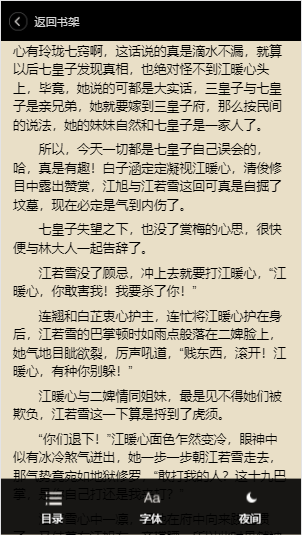
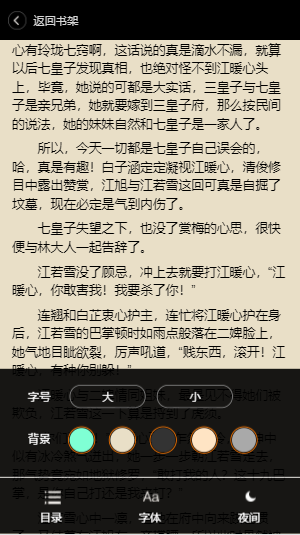

## Reader 一些说明：
在没使用数据绑定的情况下，用原生JS操作DOM。

#### 1.前端应用开发主要分三方面：
~~~
- 静态页面的制作，包括页面结构和样式

- 前端静态页面的交互，主要是一些用户交互的开发，监听事件已经监听函数

- 页面与服务器数据库的数据交互，通常将动态读取的数据动态插入的页面

~~~
#### 2.一些技术点分析
不用数据绑定，会有很多的事件监听函数

~~~
1.静态页面方面
  --静态页面的结构和样式像素还原设计稿
  --移动WebApp仿NativeApp的一些样式和布局
  --移动端的一些布局技巧
  --Base64图片、HTML5标签、CSS3样式 
  
2.移动前端页面的交互
  --移动前端Zepto，base64解码，jsonp库
  --选择器使用
  --事件监听
  
3.数据层面的交互
  --`$.get`的数据请求
  --jsop的数据请求
  --html5的本地存储local Storage

~~~

#### 3. 一些效果图

